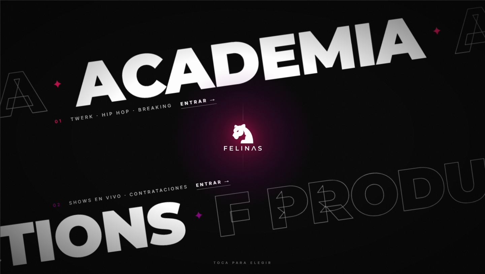

# Felinas Web

Sitio web oficial de **Pantera Felinas**, academia de danza urbana femenina. Pensado para captar alumnas nuevas: presenta la identidad de la academia, la oferta de clases y membresías, y da acceso directo a agendar una clase gratis por WhatsApp.

🔗 [felinas-web.vercel.app](https://felinas-web.vercel.app/)

---

## La experiencia

El sitio arranca con una **landing split-screen**: dos bandas diagonales, una para Academia y otra para Show, que se expanden al pasar el mouse y llevan a cada sección con una transición tipo wipe. De ahí en adelante, todo el recorrido está pensado como una sola pieza animada en vez de una serie de secciones sueltas: reveals al hacer scroll, contadores animados, parallax y loops ambientes (glow, float, bounce) en los elementos decorativos.

### `/academia`

La página principal de captación de alumnas:

- **Hero** con llamado a la acción directo a WhatsApp para agendar una clase gratis
- **About** — historia y valores de la academia (empoderamiento, autoconfianza, comunidad)
- **Stats** — números de la academia con animación de conteo al entrar en viewport
- **Clases** — catálogo de estilos: Twerk, Hip Hop, Breaking y más
- **Membresías** — planes y precios
- **FAQ** — preguntas frecuentes
- **CTA final** de conversión
- **Botón de WhatsApp** flotante, siempre accesible

### `/show`

Sección dedicada a las presentaciones y shows de Felinas, con su propia galería visual.

---

## Dirección de diseño

El sitio evita a propósito los defaults genéricos (fuentes de sistema, gradientes morados, layouts predecibles). La identidad se apoya en:

- Tipografía **Montserrat** (display) + **Inter** (texto), no las típicas Inter/Space Grotesk sueltas
- Paleta oscura de marca con acentos definidos, no tonos tibios repartidos por igual
- Composición asimétrica en la landing (bandas diagonales) en vez de un hero centrado convencional
- Movimiento orquestado con GSAP en cada entrada de página y cada scroll, no animaciones sueltas por elemento

---

## Tecnologías

- **[Astro](https://astro.build)** — sitio 100% estático, sin servidor, build a `dist/`
- **React** — solo en los islands que lo necesitan (Stats, Clases, Membresías, Landing), cargados de forma diferida (`client:visible` / `client:idle`)
- **GSAP + ScrollTrigger** — reveals, contadores, parallax y loops ambientes; respeta `prefers-reduced-motion`
- **TypeScript** — tipado en componentes y utilidades
- **Tailwind CSS** — estilos con variables de marca
- **pnpm** — gestor de paquetes

---

## Assets

Las imágenes de la academia y de los shows (logo, fotos de instructoras, galería) están en `public/assets/`, optimizadas a webp.
